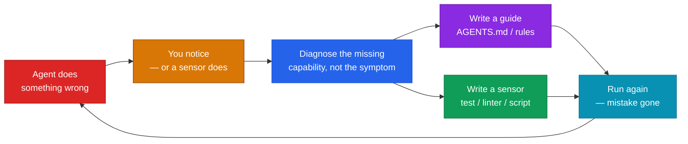
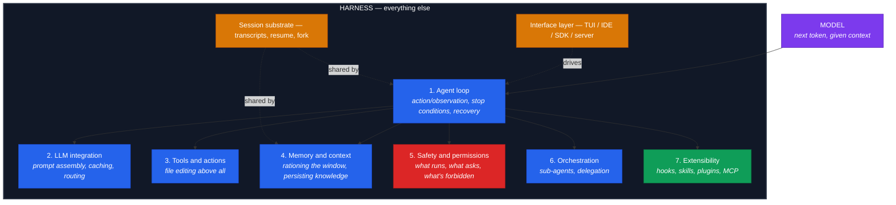

# Harness Engineering — the field guide

A 20-minute conceptual session: what harness engineering is, where the term came from, and why
it became the most discussed idea in agent engineering within five months of being named.

This repo ships a working harness for itself — [`AGENTS.md`](AGENTS.md),
[`harness-checklist.md`](harness-checklist.md) and a real sensor at
[`scripts/verify.py`](scripts/verify.py) — because the concept is unteachable without one.

```bash
python scripts/verify.py            # all local checks
python scripts/verify.py --diagrams # + validate mermaid against kroki.io
```

---

## The one-line answer

> **An agent is a model plus a harness. The model supplies the intelligence; the harness turns
> that intelligence into work.**
> — [Böckeler, *Harness engineering for coding agent users*](https://martinfowler.com/articles/harness-engineering.html), April 2026

The model contributes exactly one thing: the next token, given everything currently in its
context window. Everything else in the sentence — what goes into context, which tools exist, how
their output is formatted and truncated, when the loop stops, how failures are retried, whether
a verifier checks the work — **is the harness.**

If you have ever watched an agent reason correctly and then do something useless, you have
watched a harness failure. Not a model failure.

---

## Why it matters

### The uncomfortable finding

A position paper — [Zhang et al., *Stop Comparing LLM Agents Without Disclosing the Harness*](https://arxiv.org/abs/2606.00000)
(arXiv, May 2026) — reported that when model and harness are varied in a factorial design,
**harness configuration explained roughly 7.8× more of the performance variance than model
choice.**

Specifics from that study, which are more interesting than the headline:

- One frozen model (GLM-5.1) moved from **52.5% under a minimal harness to 65.5% under a full
  one** — a 13-point gain with the weights untouched.
- **Six of nine model-pair rankings reversed** depending on which harness was used. "The best
  model" was not a property of the model; it was a property of the harness it happened to be
  tested in.

And the mechanism is not mysterious. A weak context rule floods the window with irrelevant
files; the model is now hunting for signal on every one of fifty steps. The harness did not make
the model smarter. It made the model's job easier, fifty times.

> ⚠️ **Read the caveats before quoting the 7.8× figure from Zhang et al.**
> 1. It measures *immature* harnesses. The ceiling on harness work is set by how badly the
>    current harness is sabotaging the model — so the effect **shrinks as harnesses improve**,
>    and the easy sabotage gets engineered out.
> 2. Terminal-Bench reports the opposite conclusion ("model selection is usually more important")
>    — because it lets each model use its *own best-tuned* harness. Both are true. The answer to
>    "model or harness?" depends entirely on which one you held constant, which is why neither
>    number means much until you say what you fixed.

### The ablation nobody expected

[Lin et al., *Agentic Harness Engineering*](https://arxiv.org/) built a system that **evolves**
harnesses from observability feedback, starting from a bash-only seed. Its component ablation
is the sharpest evidence in the literature, because it isolates individual parts:

| Component | Gain |
| --- | --- |
| Tools | largest single contributor |
| Middleware / loop control | substantial |
| Long-term memory | meaningful |
| **The system prompt alone** | **negative** |

Tuning the prompt — the thing everyone obsesses over — was worth *nothing on its own*. The gains
lived in tools, loop control, and memory. And holding the base model fixed while editing only
the loop, that same study's agents lifted pass@1 on Terminal-Bench 2 from 69.7% to 77.0% —
seven points, bought entirely by the scaffold.

### The industry evidence

OpenAI's [*Harness engineering: leveraging Codex in an agent-first world*](https://openai.com/index/harness-engineering/)
(February 2026) describes shipping a large product with a team whose primary job was no longer
writing code. Their finding is the most quotable sentence in the field:

> "When something failed, the fix was almost never 'try harder.' … human engineers always
> stepped into the task and asked: **what capability is missing, and how do we make it both
> legible and enforceable for the agent?**"

That is the discipline in one question. Not "why did the model fail?" but "what check, tool, or
file would have caught this — and where does it go?"

### The part that matters to you

The reason this is worth 20 minutes: **you have been building harnesses all week.**

Every n8n workflow in this series is one. The AI Agent node is a model inside a loop with a
max-iteration cap — that is the agent loop. The tool descriptions you wrote are the tool layer.
The pinned-vector memory connected to Postgres is the memory subsystem. The trigger path that
starts the run is the entry point.

Workshop 5 is the sharpest example. That RAG workflow has three real bugs: a **hardcoded Drive
`fileId`** that makes retrieval decorative, **30-minute `insert` runs that duplicate vectors**
on every execution, and a **shared `sessionKey`** that leaks one user's chat memory to another.
Nothing in the workflow *reports* any of them. The workflow runs green. The output looks
plausible. The bugs are only findable by reading — which is exactly what a sensor replaces.

> That is the thesis of this session, stated in terms of your own repos: **an agent cannot see
> its own mistakes, and neither can a workflow.** The fix is not a better model. It is a check.

---

## Where the term came from

The vocabulary is five months old and genuinely muddled. This is the lineage, dated.

| When | Who | What they contributed |
| --- | --- | --- |
| Feb 2026 | **Mitchell Hashimoto** (Ghostty, Terraform) | Used the phrase in passing in [*My AI Adoption Journey*](https://mitchellh.com/writing/my-ai-adoption-journey), Step 5, **"Engineer the Harness"** — and gave it its most quoted definition |
| Feb 2026 | **Ryan Lopopolo** (OpenAI) | The practitioner counterpart: a million-line codebase where "the discipline shows up more in the scaffolding rather than the code" |
| Feb 2026 | **Trivedy** (LangChain) | Formalised `Agent = Model + Harness`; coined the *discipline* name in the context of Deep Agents |
| Feb 2026 | **OpenAI** | Published the vendor case study |
| Apr 2026 | **Birgitta Böckeler** | [*martinfowler.com*](https://martinfowler.com/articles/harness-engineering.html) — the **guides / sensors** framework, and the three regulation categories |
| Apr–Jul 2026 | **Academic wave** | Source-code anatomy of 11 production harnesses; AHE; the CAR decomposition; HARNESSCARD as a reporting artefact |
| Jun 2026 | **Osmani / Steinberger** | **"Loop engineering"** — stop prompting agents, *design loops that prompt your agents* |

> 🎲 **A piece of irony worth noting:** the term was named and defined from *inside LangChain* —
> the framework vendor whose libraries appear in **none** of the eleven production harnesses
> studied. LangChain's response to that absence was not to lobby; it was to ship a harness of
> its own.

### Hashimoto's definition, verbatim

> "I don't know if there is a broad industry-accepted term for this yet, but I've grown to
> calling this 'harness engineering.' **It is the idea that anytime you find an agent makes a
> mistake, you take the time to engineer a solution such that the agent never makes that
> mistake again.**"

Two things to notice.

**The direction of travel is backwards.** Not "tell the agent what to do" but "find out what
would have caught the failure, then build that." Instructions are the weakest form of this.

**He notes he didn't invent the term.** "If another one exists, I'll jump on the bandwagon." A
signals-and-noise discipline that begins by auditing its own provenance.

### The compounding loop



**Prefer the right-hand branch.** A guide is a *request*; a sensor is an *enforcement*. Every
time you can convert "remember to do X" into a check that fails when X is violated, you have
moved work from the agent's attention — its scarcest resource — to a deterministic tool.

---

## What a harness is made of

The canonical anatomy, from a source-code study of eleven production harnesses (Claude Code,
Codex CLI, Gemini CLI, Mistral Vibe, OpenHands, Aider, Mini-SWE-Agent, Hermes, Pi, OpenCode,
OpenClaw) published July 2026. Every one of them takes a position on all seven — including the
deliberate absences.



### The minimal and maximal forms — the useful part

The study's most useful contribution is showing how small each subsystem can shrink, and where
a decade of engineering headroom sits in each.

| Subsystem | Minimal | Maximal |
| --- | --- | --- |
| **Agent loop** | Mini-SWE-Agent: a `while` over one bash tool | OpenHands: event-sourced conversation over a persistent log, with parallel action batches |
| **LLM integration** | One LiteLLM call, one Jinja template | Five owned transports, 29 provider profiles, server-delivered model catalog |
| **Tools & actions** | Bash only | 43 typed tools with deferred loading; tool calls executed as code |
| **Memory & context** | Unbounded linear history | Agent-maintained cross-session memory pipeline; graph-based context distillation |
| **Safety & permissions** | Cost and step limits | Policy rules + an LLM approval reviewer + native OS sandboxing on three platforms |
| **Orchestration** | None — single-agent by design | Recursive composition; cross-vendor meta-harness over 11 harnesses |
| **Extensibility** | Python protocols | Everything-is-an-extension runtime; marketplace-distributed plugins |

**The existence proof at the floor:** Mini-SWE-Agent implements all seven subsystems in
roughly 100 lines of Python and reports SWE-bench Verified results in the same range as systems
three orders of magnitude larger. Loop sophistication does not predict benchmark performance.

> ⚠️ **But the floor being low does not mean high is pointless.** What separates the floor from
> production systems is not task completion — it is **safety, recovery, cost management and
> extensibility**. The minimal harness wins the benchmark and loses every deployment.

### Two empirical absences

Across roughly four million lines of Python, TypeScript and Rust in the corpus:

- **No agent runtime imports a general-purpose agentic framework.** Not LangChain, not
  LangGraph, not AutoGen — and Gemini CLI uses neither of Google's own.
- **None retrieves code with vector embeddings.** The field runs on hand-rolled async loops and
  *deterministic* retrieval: ripgrep, tree-sitter, glob, auto-discovered Markdown context files.

Both absences are now dissolving. **Harness–framework merger:** LangChain shipped a harness;
framework vendors now ship harnesses; the distinction between "library you import" and
"runtime you work inside" is dissolving from both directions. And RAG over code is arriving —
which is why [workshop 5](https://github.com/Gursimaran21/NextLeap-RAG-Implementation-Pinecone-Vector-DB-Gemini-Embeddings-05-October-2026)
matters more than it did in April.

---

## Guides and sensors

Böckeler's framework is the most systematic thing written on this, and it is worth learning
cold because it tells you *which kind of control* you are building.

| | **Guides** (feed-forward) | **Sensors** (feedback) |
| --- | --- | --- |
| When | **Before** the agent acts | **After** it acts |
| Job | Raise the probability of a good first attempt | Catch the failure and enable self-correction |
| Form | `AGENTS.md`, conventions, structure, guardrails | Tests, linters, type checkers, custom scripts |
| Strength | Cheap, scales, prevents the class of error | **Catches what nobody thought to prevent** |

A well-built harness serves two goals, and both matter:

1. Increase the probability the agent gets it right the first time.
2. Provide a feedback loop that self-corrects as many issues as possible **before they reach
   human eyes** — reducing review toil.

> 💡 **Böckeler's sharpest observation:** sensors are especially powerful when their output is
> optimised for *LLM consumption*. A custom linter message that ends with "here is what to fix"
> is a positive kind of prompt injection. Your test failures should read like instructions.

### Computational vs inferential

| | **Computational** | **Inferential** |
| --- | --- | --- |
| Runs on | CPU | GPU / NPU |
| Examples | Tests, linters, type checkers, structural analysis | Semantic analysis, AI code review, LLM-as-judge |
| Speed | Milliseconds to seconds | Slower |
| Reliability | Reliable | Non-deterministic |

Computational guides and sensors are cheap and deterministic — run them on every change.
Inferential controls cost more but add the semantic judgement a type checker cannot: *"this
function's name says it validates, but it returns on the happy path before checking anything."*

### What a harness regulates — three categories

Böckeler's second axis, and the one people miss. Complexity and harnessability **vary by
category**, so naming the category gives you a more precise conversation.

| Category | Governs | Example control |
| --- | --- | --- |
| **Maintainability** | Is this code understandable in six months? | Function-length lint rule, dead-code detection |
| **Architecture fitness** | Does the structure match its intended shape? | Module-boundary enforcement, dependency-direction rules, fitness functions |
| **Behaviour** | Does it *function* as required? | The hard one — see below |

Behaviour is the elephant. Most people granting high autonomy do this: feed-forward, a
functional specification of varying detail; feedback, check that the AI-generated test suite is
green with reasonable coverage, plus manual testing. That is the honest state of it. There is no
reliable way to sense arbitrary functional behaviour.

### Not every codebase is equally harnessable

- **Strongly typed languages** give you type-checking as a free, excellent sensor.
- **Clear module boundaries** afford architectural constraint rules.
- **Frameworks** that abstract away detail increase the agent's success rate implicitly.

Without those properties, those controls are not available to build. And this splits sharply by
project type:

- **Greenfield** teams can bake harnessability in from day one. Technology and architecture
  choices determine how governable the codebase will be.
- **Legacy** teams face the harder problem: **the harness is most needed exactly where it is
  hardest to build.**

> ⚠️ **The trap for greenfield:** you are making decisions today that will constrain what you can
> verify for years. An untyped codebase with no module boundaries is choosing *against* future
> agent autonomy — a decision that looks like a productivity choice now.

### Variety reduction — the reason to commit to a topology

**Ashby's Law of Requisite Variety:** a regulator must have at least as much variety as the
system it governs, and can only regulate what it has a model of.

An LLM coding agent can produce almost anything. Committing to a topology — business services
exposing APIs, event processors, dashboards, the shapes that cover roughly 80% of what
enterprises need, as [Böckeler](https://martinfowler.com/articles/harness-engineering.html)
describes — narrows that space, making a comprehensive harness *achievable*. Defining
topologies is a variety-reduction move.

This is the most underrated argument in the field. It says: **standardising your stack is not
bureaucracy, it is what makes autonomy safe.**

---

## What a harness is not

The term is used loosely, and four boundary cases cause most of the confusion.

| Not this | Because |
| --- | --- |
| **A scaffold** | Near-synonyms in practice. Where useful: *scaffold* = the structural code (the loop, the registries); *harness* = the shipped runtime artifact embedding it. Mini-SWE-Agent's scaffold is 100 lines of Python. Claude Code's harness is a product with a TUI, permission system, and plugin ecosystem. |
| **An agentic framework** | A framework (LangChain, AutoGen, CrewAI) is a library you *import* to build an agent. A harness is a runtime you *work inside*. Clean in 2025; dissolving in 2026 from both directions. |
| **An evaluation harness** | The SWE-bench harness wraps an agent to *run* it against tasks. An agent harness wraps a model to make it *act*. Same word, opposite direction of wrapping. |
| **An orchestrator** | A meta-harness coordinates harnesses from above and implements no editing loop of its own. Omnigent orchestrates eleven vendor harnesses — it is evidence about harnesses, not one. |

### Context engineering vs harness engineering

They are not rivals, and they are not the same size.

**Context engineering** = managing what enters the context window at inference time.
**Harness engineering** = designing the runtime that produces that window, plus everything
else about how the model acts over time.

> "Context engineering provides us with the means to make guides and sensors available to the
> agent." — Böckeler

Context engineering is **subordinate**, not coextensive. The harness also includes tool access
decisions, memory architecture, autonomy level, trust position, and observation surface — none
of which reduces to window management. Teams thinking in terms of "prompt engineering" have
vocabulary for one mechanism and none for the system those mechanisms compose.

A useful third distinction, since teams routinely conflate all three:

| Discipline | Governs | Fails as |
| --- | --- | --- |
| **Context** | What the model sees *this call* | Noise dilutes signal |
| **Memory** | What survives *between calls* | Forgets what mattered — or carries a stale error forward and compounds it |
| **Harness** | Whether the call is *retried, bounded, guarded* | Runs unbounded, burns budget, takes an irreversible action |

**When your agent breaks, the useful first question is not "which model?" — it's "which
discipline?"**

---

## The economics, and the limit

Harness building is expensive. So the goal is not to remove human input — it is to **direct it
to where it matters most.**

And there is a cost that does not appear on any invoice. Delegating the work removes the
practice that produced the judgement to delegate it. You cannot engineer a harness you do not
have the expertise to specify. A harness encodes your taste; if you have none, you have
automated an arbitrary process at scale.

### What good harnesses do not do

- **Run agents for the sake of running agents.** An idle agent is not free.
- **Let the agent set your attention rhythm.** Notifications are a design failure. You choose
  when to check in; it does not get to interrupt you.
- **Grant autonomy you have not earned.** Autonomy should be demonstrated, then extended — not
  assumed. Each additional step of autonomy is a decision to trust a harness you have measured.
- **Review everything equally.** Production code gets line-by-line attention; a throwaway
  prototype gets none. Match review effort to stakes.
- **Trust the agent's self-report of its own work.** That is not verification. That is the
  model's belief about the world, which is the thing you cannot afford to be wrong about.

### What it is good for

| Use a harness for | Do not use one for |
| --- | --- |
| Work an agent does *better than you* | Work that is your job to learn |
| Tasks where the answer is verifiable | Judgment about what should exist |
| Repetition across many items | Decisions with unclear success criteria |
| Anything where a check can be written | Anything where the check *is* the hard part |

---

## Run this harness

The point of this repo is that it does the thing it describes. `AGENTS.md` and `verify.py` were
written against real observed failures, and the loop has already closed once: `verify.py`'s
provenance check flagged **my own** uncited statistics claim in `AGENTS.md` the first time it
ran, which is the exact failure that rule exists to prevent.

```bash
$ python scripts/verify.py

[PASS] stdlib-only imports           all imports within 14 allowed stdlib roots
[PASS] no committed secrets          3 file(s) scanned
[PASS] no n8n instance hostnames
[PASS] required files present       all 5 required files exist
[PASS] mermaid structure (offline)   5 block(s) scanned
[PASS] statistics carry provenance

6 passed, 0 failed, 0 skipped
```

### What each check is a sensor for

| Check | The failure it prevents |
| --- | --- |
| `stdlib-only imports` | An agent adds `requests` for one call, breaking the script on a clean install |
| `no committed secrets` | Credentials land in a public repo — the exact leak that lived in the early n8n workflow exports |
| `no n8n instance hostnames` | A real Cloud hostname plus its trigger path ships as a usable credential |
| `required files present` | Documentation and reality drift apart silently |
| `mermaid structure` | Nested parentheses inside a subgraph label — committed, renders as a parse error |
| `mermaid parse (kroki.io)` | A broken diagram nobody notices because nobody rendered it |
| `statistics carry provenance` | A hedged research finding becomes a marketing claim because the caveat was dropped |

Every rule in `AGENTS.md` also carries the failure that produced it. That is the discipline, not
a writing convention — **a rule with no story behind it will not survive the next refactor.**

---

## Session context

| Segment | Duration | Focus |
| --- | --- | --- |
| Harness Engineering | 20 mins | What it is · why it matters · how to build one |

### Session map

| # | Repo | Introduced |
| --- | --- | --- |
| 1 | [Google Calendar AI Assistant](https://github.com/Gursimaran21/NextLeap-Google-Calendar-Assistant-04-October-2026) | Single agent + tools |
| 2 | [Build MCP Server and Client](https://github.com/Gursimaran21/NextLeap-Built-MCP-Server-and-Client-04-October-2026) | **MCP** — tools over a standard |
| 3 | [Multi-Agent System — Newsletter Agent](https://github.com/Gursimaran21/NextLeap-Multi-Agent-System-Newsletter-Aagent-04-October-2026) | Multi-agent orchestration |
| 4 | [Building & Sharing n8N Workflows](https://github.com/Gursimaran21/NextLeap-Building-N8N-Workflows-and-sharing-on-Github-04-October-2026) | Building & publishing workflows |
| 5 | [RAG — Pinecone + Gemini](https://github.com/Gursimaran21/NextLeap-RAG-Implementation-Pinecone-Vector-DB-Gemini-Embeddings-05-October-2026) | RAG, embeddings, vector stores |
| 6 | [Claude: MCP, Skills & Cowork](https://github.com/Gursimaran21/NextLeap-Claude-MCP-Skills-and-CoWork-05-October-2026) | MCP in Claude · Skills · Cowork |
| 7 | **This repo** | The runtime around the model |

> 💡 **The through-line:** sessions 1–6 were *what the model can reach* — tools, MCP servers,
> skills, retrievers, orchestrators. This session is **what happens when the model's output
> cannot be trusted unchecked.** Every prior session handed you a way to make an agent act more.
> This one is about making sure you can find out when it did the wrong thing.

### Key takeaways

- **Agent = Model + Harness.** The model supplies one token at a time. Everything else is engineering.
- **The bottleneck moved.** It is no longer model capability; it is the environment the model runs in.
- **Find the missing capability, not the symptom.** "What check would have caught this?" beats "try harder" and beats adding another paragraph to the prompt.
- **Guides steer, sensors enforce.** Convert "remember to do X" into a check that fails when X is violated.
- **Context and memory and harness are three disciplines.** When it breaks, name which one before blaming the model.
- **Ashby's law is your friend.** A narrow topology is what makes a comprehensive harness possible — and standards are what make autonomy safe.

---

## Repository layout

```
NextLeap-Harness-Engineering-05-October-2026/
├── README.md                    # this file — the session content
├── AGENTS.md                    # a real harness: rules, each with its originating failure
├── harness-checklist.md         # the guides/sensors workflow, applied to a codebase
├── scripts/
│   └── verify.py                # the sensors — stdlib only, runs offline
└── LICENSE
```

## Further reading

- [Harness engineering for coding agent users — Böckeler, martinfowler.com](https://martinfowler.com/articles/harness-engineering.html)
- [Harness engineering: leveraging Codex in an agent-first world — OpenAI](https://openai.com/index/harness-engineering/)
- [My AI Adoption Journey — Mitchell Hashimoto](https://mitchellh.com/writing/my-ai-adoption-journey)
- [Harness Engineering: Anatomy, Architecture, and Evolution of Coding Agents](https://arxiv.org/abs/2609.00006) — source-code study of 11 harnesses (Jul 2026)
- [Building Effective Agents — Anthropic](https://www.anthropic.com/engineering/building-effective-agents)
- [Effective Context Engineering for AI Agents — Anthropic](https://www.anthropic.com/engineering/effective-context-engineering-for-ai-agents)
- [Writing Effective Tools for AI Agents — Anthropic](https://www.anthropic.com/research/writing-tools-for-agents)

---

## License

Released under the [MIT License](LICENSE).